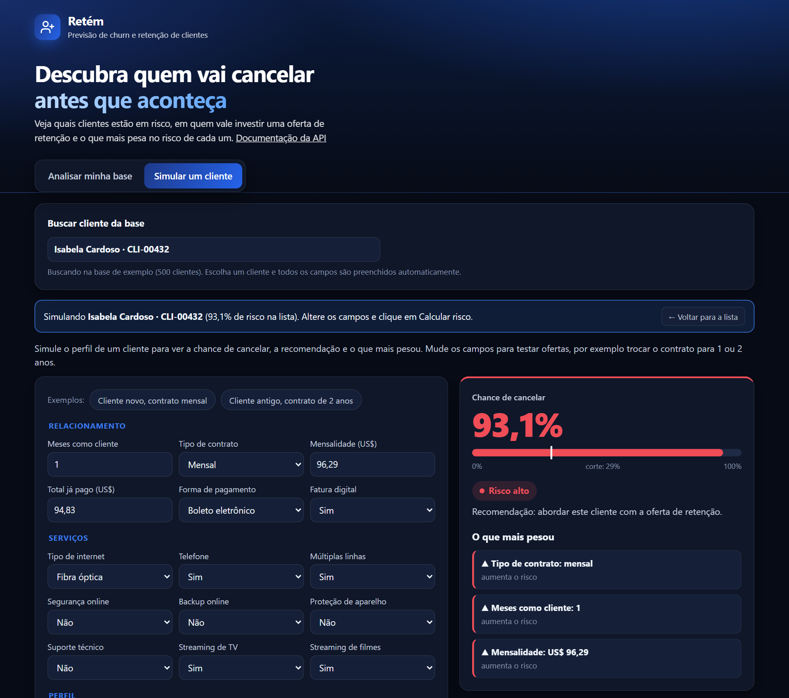
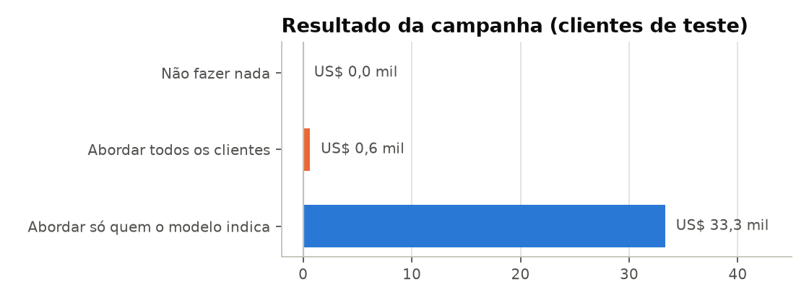
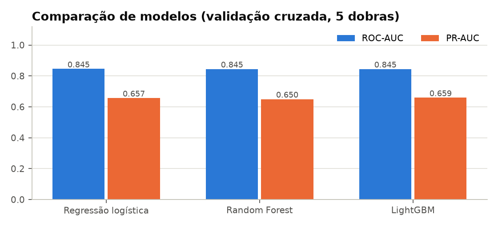
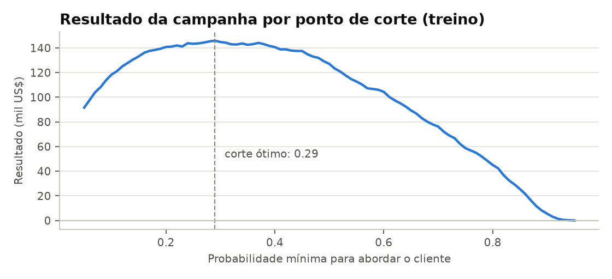
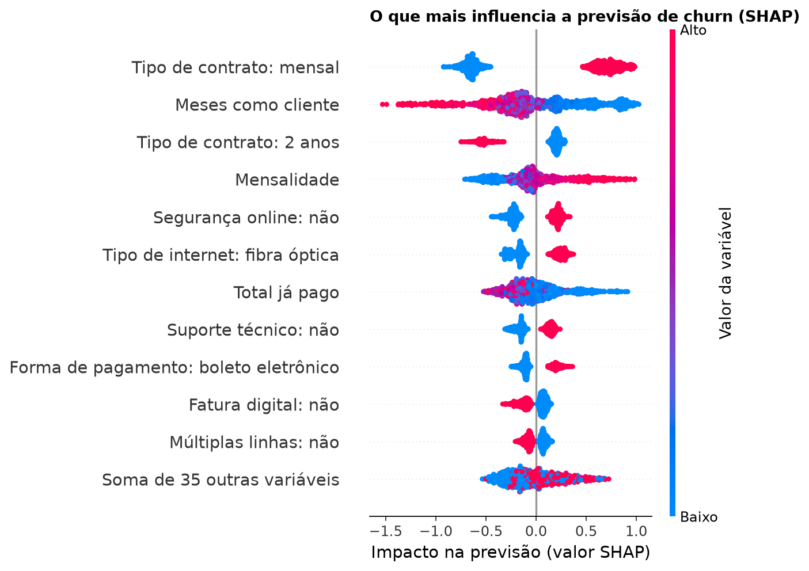

# 📉 Previsão de Churn: do modelo à produção

Modelo de machine learning que estima a chance de cada cliente cancelar o serviço, decide **quem vale abordar** com uma oferta de retenção e **explica o porquê** de cada previsão. O modelo está em produção como API e app web.

**[🌐 Testar o app](https://previsao-churn.onrender.com)** · **[📖 Documentação da API](https://previsao-churn.onrender.com/docs)**

> Hospedado no plano gratuito do Render: se o app estiver parado, o primeiro acesso leva cerca de 1 minuto para carregar.



## O problema

Numa empresa de telecomunicações com 7.043 clientes, **26,5% cancelaram**, levando **30% da receita mensal**. Oferecer desconto para todo mundo não resolve: o desconto dado a quem não ia sair consome todo o ganho. A pergunta é **em quem investir a oferta**.

## Resultado

Simulação de uma campanha de retenção nos 1.409 clientes de teste, que o modelo nunca viu:

| Estratégia | Clientes abordados | Resultado |
|---|---:|---:|
| Não fazer nada | 0 | US$ 0 |
| Abordar todos os clientes | 1.409 | US$ 0,6 mil |
| **Abordar só quem o modelo indica** | **544** | **US$ 33,3 mil** |

O modelo encontra **77% dos clientes que iam cancelar** abordando menos de 40% da base.



**Premissas** (em `src/churn/negocio.py`, fáceis de ajustar): a oferta é 1 mês grátis, custa US$ 5 de operação por contato, convence 30% dos clientes que iam cancelar e cada cliente retido preserva 12 meses de mensalidade.

## Como foi feito

**1. Análise exploratória** ([notebook](notebooks/01_analise_exploratoria.ipynb)). Os sinais mais fortes são o tipo de contrato (42,7% de churn no mensal contra 2,8% no de 2 anos), o tempo de casa (52,9% de churn nos primeiros 6 meses) e a falta de suporte técnico.

**2. Comparação de modelos** com validação cruzada estratificada de 5 dobras. Como a classe de interesse é minoritária, a escolha foi pela **PR-AUC**, não pela acurácia.



Os três modelos empatam em ROC-AUC (0,845), e o LightGBM fica levemente à frente em PR-AUC. No teste: ROC-AUC 0,845, PR-AUC 0,655, recall 77% e precisão 53%.

**3. Ponto de corte pelo lucro, não pelo padrão de 0,5.** O limite de probabilidade para abordar um cliente foi escolhido para maximizar o resultado da campanha, usando só dados de treino. O corte ótimo ficou em **0,29**.



**4. Explicabilidade com SHAP.** Cada previsão vem acompanhada dos fatores que mais pesaram, o que permite ao time de retenção adaptar a abordagem ao motivo do risco.



## Em produção

| Componente | Tecnologia |
|---|---|
| API | FastAPI, com validação dos dados de entrada (Pydantic) e documentação automática em `/docs` |
| Explicação por cliente | Valores SHAP nativos do LightGBM, agrupados por variável original |
| App web | HTML + JavaScript servido pela própria API |
| Empacotamento | Docker |
| Hospedagem | Render, com deploy automático a cada push na branch main |
| CI | GitHub Actions: testes automatizados a cada push |

Exemplo de chamada:

```bash
curl -X POST https://previsao-churn.onrender.com/prever -H "Content-Type: application/json" -d '{
  "gender": "Female", "SeniorCitizen": 0, "Partner": "No", "Dependents": "No", "tenure": 3,
  "PhoneService": "Yes", "MultipleLines": "No", "InternetService": "Fiber optic",
  "OnlineSecurity": "No", "OnlineBackup": "No", "DeviceProtection": "No", "TechSupport": "No",
  "StreamingTV": "Yes", "StreamingMovies": "Yes", "Contract": "Month-to-month",
  "PaperlessBilling": "Yes", "PaymentMethod": "Electronic check",
  "MonthlyCharges": 95.5, "TotalCharges": 280.0}'
```

```json
{
  "probabilidade_churn": 0.8051,
  "risco": "alto",
  "abordar_cliente": true,
  "ponto_de_corte": 0.29,
  "principais_fatores": [
    {"variavel": "Tipo de contrato", "valor": "mensal", "efeito": "aumenta o risco", "impacto": 0.968},
    {"variavel": "Meses como cliente", "valor": "3", "efeito": "aumenta o risco", "impacto": 0.512},
    {"variavel": "Mensalidade", "valor": "US$ 95,50", "efeito": "aumenta o risco", "impacto": 0.393}
  ]
}
```

## Como rodar localmente

```bash
python -m venv .venv
.venv/Scripts/activate            # no Linux/macOS: source .venv/bin/activate
pip install -r requirements.txt

PYTHONPATH=src python -m churn.treino   # treina, avalia e salva modelo e gráficos
uvicorn api.main:app --reload           # app em http://localhost:8000
pytest                                  # testes da API
```

## Estrutura

```text
data/            base Telco Customer Churn (IBM)
notebooks/       análise exploratória
src/churn/       limpeza, premissas de negócio, treino e previsão
api/             API FastAPI e app web
models/          modelo treinado
reports/         métricas e gráficos
tests/           testes automatizados da API
```

> Base de dados: [Telco Customer Churn](https://github.com/IBM/telco-customer-churn-on-icp4d), disponibilizada pela IBM.
